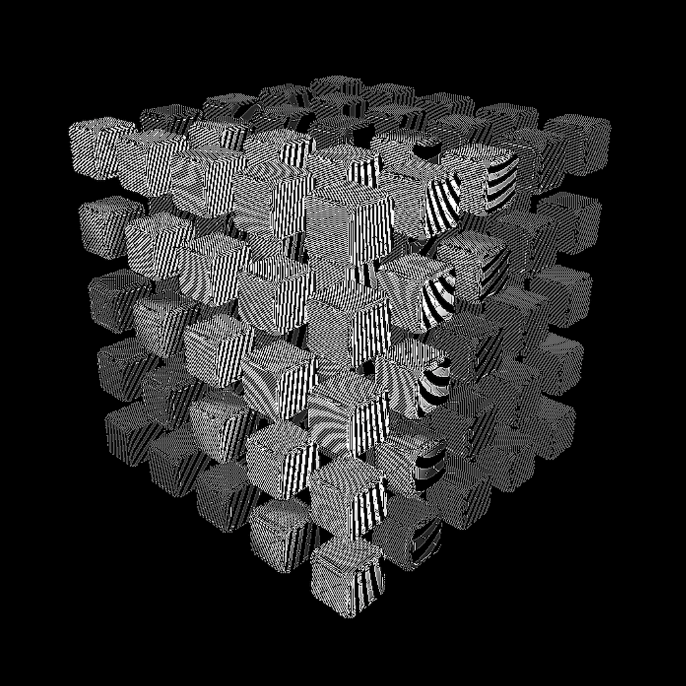

an implementation of [deferred rendering](https://en.wikipedia.org/wiki/Deferred_shading) to render a placeholder 3d object

**_NOTE_**: there is an obj asset that's meant to go along with this.
however, i don't remember where it's from and i'm not sure i have the permissions to redistribute it.

as a result, this won't work immediately unless you substitute in a pretty simple obj file to load with whatever basic obj loading is implemented here (and iirc it really is the bare minimum).

## rendering methods

supports different rendering methods:
* phong
* pbr (not 100% working iirc)

## textures

different textures can be toggled for the final render:
* diffuse texture
* normal texture
* metallic texture
* roughness texture
* polka dots texture
* stripe texture

## debug textures

can output various debug steps to the final frame including:
* uv
* positions
* diffuse color
* normals
* pbr
* depth

## post-processing

supports different post-processing effects over the final render including:
* pixel grid
* outline on all rendered objects
* gaussian and box blurs
* sharpen
* emboss
